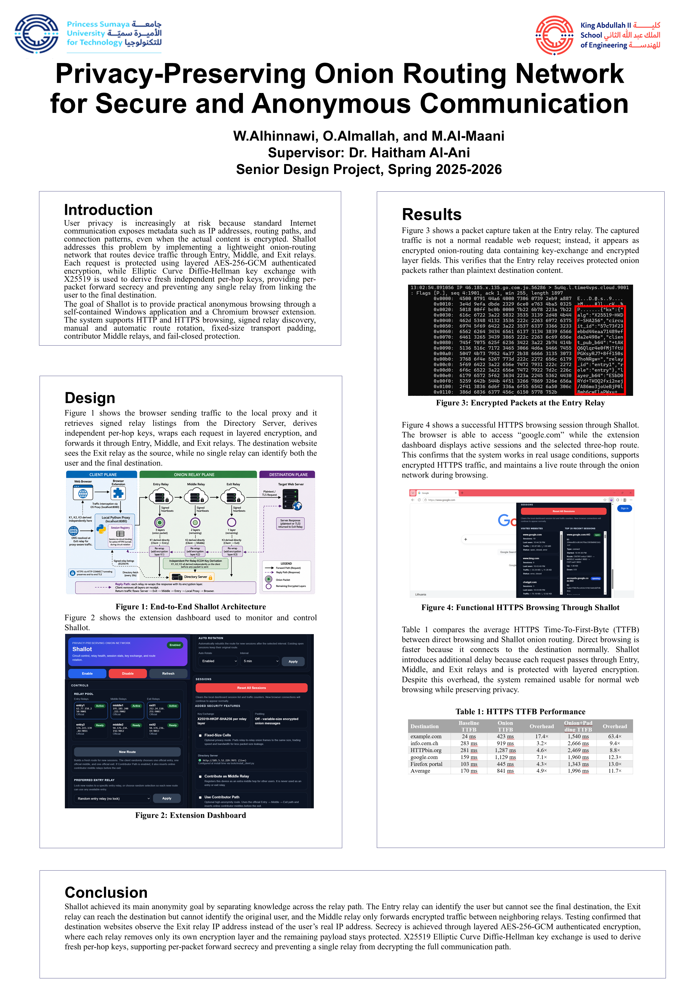

# 🎓 Design and Implementation of a Privacy-Preserving Onion Routing Network for Secure and Anonymous Communication



## 📌 Project Overview
**Shallot** is a lightweight, privacy-preserving onion routing network engineered to protect internet users from metadata surveillance, connection pattern tracking, and IP identity exposure. Standard internet interactions leak routing properties and connection characteristics even when communication bodies are fully encrypted; **Shallot** mitigates this by abstracting endpoint connections into a resilient multi-hop circuit. 

The project name is a deliberate play on **Tor (The Onion Router)**. Since a shallot is a smaller, milder member of the onion family, **Shallot** is designed as a more accessible, lightweight browser-integrated alternative for everyday users. It delivers an anonymous browsing pipeline through a single, standalone Windows executable coupled with a modern, one-click Chromium browser extension. This setup eliminates the need for advanced command-line terminal operations, manual network configurations, or local language runtime installations.

---

## 🛠️ System Architecture & Planes of Operation
Shallot partitions its system infrastructure into three distinct operational planes to preserve separation of concerns and enable seamless horizontal scaling:

```text
[ Chromium Extension ] <--- Control API (Port 7070) ---> [ Python Asyncio Proxy ] (Client Plane)
         |                                                           |
         | (Configures Local System Proxy)                            | Intercepts Traffic
         v                                                           v
[ Normal Web Browser Traffic ] ===========================> [ Local Interception Port 8080 ]
                                                                     |
                                                                     | (Layered Onion Encryption)
                                                                     v
                                                          =======================
                                                          |   DIRECTORY PLANE   |
                                                          |  [Directory Server] | (Tracks node status)
                                                          =======================
                                                                     |
                                                                     v
                                                          =======================
                                                          |     RELAY PLANE     |
                                                          | 1. [Entry Relay]    | (Strips Layer 3)
                                                          |        v            |
                                                          | 2. [Middle Relay]   | (Strips Layer 2)
                                                          |        v            |
                                                          | 3. [Exit Relay]     | (Strips Layer 1)
                                                          =======================
                                                                     |
                                                                     v
                                                          [ Destination Web Server ]

1. Client Plane (Standalone Application & Local Proxy)
The Launcher (Shallot.exe): Compiled via PyInstaller in onedir mode, this bootstrap asset encapsulates a private copy of the Python 3.11 interpreter along with all runtime cryptographic components. It displays a Tkinter-driven GUI window on the application's primary thread to safely mirror system execution logs and connection health indicators to the user.

The Interception Proxy: Operates concurrently on a background daemon thread utilizing Python's asynchronous networking framework (asyncio). It monitors local port 8080 to capture outbound browser actions while presenting a secure Control API endpoint on port 7070 for interaction with the user frontend.

2. Directory Plane (Central Orchestrator)
Directory Server: Anchored on an isolated Linux KVM VPS instance, it maintains a global mapping of all participating components within the relay topology.

Automated Node Pruning: Relays broadcast an Ed25519-signed registration structure upon initialization. The node stays active by publishing a signed heartbeat every 20 seconds. If a node remains unresponsive for more than 60 seconds, the Directory Server drops it from the active circuit pool to ensure high network reliability.

3. Relay Plane (Multi-Hop Tunnels & The Contributor Path)
Core Circuit Topology: Standard data transmissions flow across a strict three-node relay sequence: Entry Node $\to$ Middle Node $\to$ Exit Node. Knowledge isolation is strictly enforced; the Entry node retains client metadata but lacks destination context, the Middle node remains completely blind to both ends, and the Exit node addresses the destination target without discovering the originating user client.

The Volunteer Contributor Path: Designed to foster decentralized scaling, the network allows voluntary third-party user nodes to contribute relay bandwidth dynamically. To guarantee security and eliminate accidental legal vulnerabilities, the Directory Server caps circuit extensions at a maximum of three volunteer nodes and constrains them exclusively to Middle-relay roles. Exit-relay traffic to the public internet is managed solely by authorized project core nodes.

🔒 Security Specifications & Cryptographic MatrixShallot relies entirely on modern open-source cryptographic algorithms and protocol layouts, referencing rigorous security models outlined in NIST FIPS 197 and NIST SP 800-52 Rev. 2:

Symmetric Layer Processing (AES-256-GCM): Outbound data payloads are compressed into nested envelopes using unique 256-bit keys. Galois/Counter Mode (GCM) ensures authenticated encryption, providing both data confidentiality and absolute payload integrity verification at each individual relay hop.

Asymmetric Key Exchanges (X25519 ECDH): Ephemeral Elliptic-Curve Diffie-Hellman key exchanges build distinct session materials between the local client proxy and every standalone hop within the selected route. This limits data compromise if a future node is breached.

Trust & Signature Framework (Ed25519): Key structures published by the Directory Server use Trust-On-First-Use (TOFU) key pinning secured via Ed25519 signatures, shielding the relay pool definition from manipulation.

Replay Protection Matrix: Relays host a lightweight, stateless short-lived cache tracking an inspection key calculated from an incoming packet's timestamp and cryptographic nonce, successfully dropping redundant requests.

Traffic Deception (Uniform Transport Padding): Features an optional uniform-padding framework that packs varying messaging payloads into fixed-size transport blocks. This counteracts traffic-analysis side-channel attacks that attempt to fingerprint sites based on packet size.

🌐 Browser Integration: Manifest V3 SubsystemThe browser interface is built as a lightweight, clean Chromium Manifest V3 extension. To prevent performance overhead within the browser’s primary rendering loop, all routing mechanics and cryptographic handshakes are delegated to the underlying local proxy process.

The extension consists of 5 core files:
1- manifest.json – Explicitly defines security declarations, API boundaries, and resource access settings.
2- background.js – Service worker handling interactions with Chrome’s Core Proxy configuration APIs.
3- popup.html – Structural layout for the interactive dashboard user menu.
4- popup.css – Clean, modern user interface layout rules.
5- popup.js – Frontend interaction rules mapping interface commands directly to the proxy Control API.

🔒 Cross-Origin Security & Token PinningTo prevent malicious scripts running on open tabs from hijacking the proxy via cross-origin calls, the proxy generates an unguessable security bearer token file (control_token.js) on startup. The browser extension imports this file, and all requests targeting the Control API must present this token or they are dropped immediately by the proxy firewall.

🎛️ Interactive Extension ControlsThe Manifest V3 dropdown popup puts deep network control into an easy-to-use user dashboard:

Onion-Routing Toggle: One-click activation to immediately flip system-wide configuration between local proxy tunneling and direct routing.

Circuit Reconstruction: Instantly drops the current 3-hop relay line and triggers an ephemeral key exchange to build a fresh circuit path.

Entry-Relay Pinning: Locks the primary connection point to a single verified relay identifier, minimizing long-term traffic-correlation profiling risks.

Auto-Circuit Rotation Configuration: Programmable settings enabling automated, periodic path shifts at custom intervals.

Padding Subsystem Control: Flips uniform transport block padding ON/OFF to handle strict traffic analysis protection.Contributor Mode Toggle: Instantly initializes a local background relay worker, turning the user's local node into a verified Middle relay to help scale the broader community network.

Real-Time Data Streams: Monitored analytics tracking active node hostnames, system component health, established sessions, and live payload data usage (uploaded and downloaded KB).


📦 Repository Structure
├── src/
│   ├── client/
│   │   ├── launcher.py               # Main PyInstaller bootstrapper & Tkinter UI
│   │   ├── proxy_server.py           # Asyncio network processing proxy framework
│   │   ├── gui_window.py             # UI configuration panel & color status indicators
│   │   ├── runtime_paths.py          # Resolves PyInstaller virtual frozen asset paths
│   │   └── relay_common.py           # Shared cryptographic operations & GCM decryption routine
│   ├── relays/
│   │   ├── entry_node.py             # Entry-hop processing node logic
│   │   ├── middle_node.py            # Middle-hop blind forwarding engine
│   │   └── exit_node.py              # Exit-hop request processor & identity sanitizer
│   └── directory/
│       └── directory_server.py       # Core tracking node, monitoring loop & signature checker
├── extension/                        # Unpacked Chromium Manifest V3 Web Extension
│   ├── manifest.json                 # Security scoping and extension manifest metadata
│   ├── background.js                 # Chrome proxy API state manager worker
│   ├── popup.html                    # Interface skeleton for the dashboard panel
│   ├── popup.css                     # Graphical styling layouts
│   └── popup.js                      # UI script linking interface to proxy Control API
├── tools/
│   └── install_client.py             # Embeds core server endpoints & pinned public keys
└── build.ps1                         # Fully automated compilation and asset bundling script


🚀 Installation & Local Deployment Guide
Running via the Standalone Windows Bundle
Navigate to your local directory containing the extracted project assets.

Open the dist/Shallot/ directory.

Double-click Shallot.exe to start up the environment.

The status dashboard window will open, display diagnostic connection messages, and automatically launch your local background interception services.

Installing the Browser Extension Control Panel
Launch any modern Chromium-based browser (Google Chrome, Microsoft Edge, Brave).

Enter chrome://extensions/ directly in your navigation address bar.

Locate the toggle switch labeled Developer mode in the top-right corner and switch it ON.

Click the Load unpacked button visible in the upper-left area.

In the file picker, select the extension/ folder located inside your local project workspace.

The Shallot extension icon will appear in your browser toolbar, giving you full control over your onion network.

⚙️ How Traffic Handling Works Behind the Scenes
Shallot adapts its routing logic based on connection protocol signatures to guarantee secure data handling:

HTTPS Traffic (End-to-End TLS Integrity): Secure requests rely on the HTTP CONNECT protocol layout. The local proxy interceptor structures a direct data pipe across the three relays. Encrypted TLS handshakes pass completely untouched directly to the target destination server, verifying end-to-end TLS integrity while blocking the local proxy from reading user web content.

HTTP Traffic (Single Round-Trip Execution): Cleartext requests route via an exit_request structure. The local proxy gathers data points into an individual, layered onion object. The Exit relay completes the endpoint query on behalf of the client, captures the target server's response payload, multi-encrypts it back through the circuit, and sends it back to the local client proxy.

Fail-Closed Security Design: If an active onion path drops or an intermediate node fails, the proxy engine enforces a strict fail-closed error state. It cuts off direct external internet fallback, preventing accidental leaks of your raw, unencrypted public IP address.

📈 Performance & Verification Summary
Verification and load testing were conducted across seven production Linux KVM Virtual Private Servers rented via Time4VPS (2 Entry nodes, 2 Middle nodes, 2 Exit nodes, and 1 centralized Directory Server):

Anonymity and IP Masquerading: Direct inspections via network logging tools like tcpdump and packet capture sniffers verified absolute data isolation. No single relay node ever handles both the source client IP address and the destination target hostname simultaneously. Public identification sites recognize the client connection coming solely from the Exit relay's endpoint (e.g., Vilnius, Lithuania) rather than the residential network source.

Latency Overhead Overview: * Standard Onion Circuits: Averaged a Time-To-First-Byte (TTFB) overhead around 4.9x the speed of baseline unproxied connections. This latency is primarily caused by multi-layered encryption handshakes and transit routing steps across multiple remote server nodes.

With Uniform Padding Enabled: Averaged a TTFB overhead around 11.7x the baseline speed. This increased delay is expected due to the deliberate processing and scheduling overhead required to generate uniform-sized dummy packet layers.

## 🎓 Academic Credits & Disclaimer
This software was engineered and deployed by Wajdi Alhinnawi, Omar Almallah, and Mohammad Al-Maani under the expert supervision of Dr. Haitham Al-Ani. The project was submitted in partial fulfillment of the requirements for the Bachelor of Science degrees in Computer Engineering and Networks & Information Security Engineering at Princess Sumaya University for Technology (PSUT) in Amman, Jordan.

## ⚠️ Acceptable Use Policy
This network framework was developed exclusively as an educational prototype and research testbed. All functional testing and performance verification exercises were completed in controlled environments and dedicated infrastructure. Using this system to intentionally bypass local regulations, violate institutional policies, or facilitate illicit actions is strictly prohibited.

* **Current Infrastructure Status:** Please note that the production infrastructure utilized for our testing phase (the 7 live Linux KVM VPS nodes and central Directory Server) was funded temporarily for academic evaluation. Because the graduation project timeline has officially concluded, these live remote servers are no longer being rented, meaning the live public network is offline and the active deployment will not work out-of-the-box.
* **Local Evaluation:** The source code itself remains fully complete and functional. If you wish to deploy or test the network, you can still host the components independently (relays, client proxy, directory server) on your own local machine or private servers and update the address configurations.
